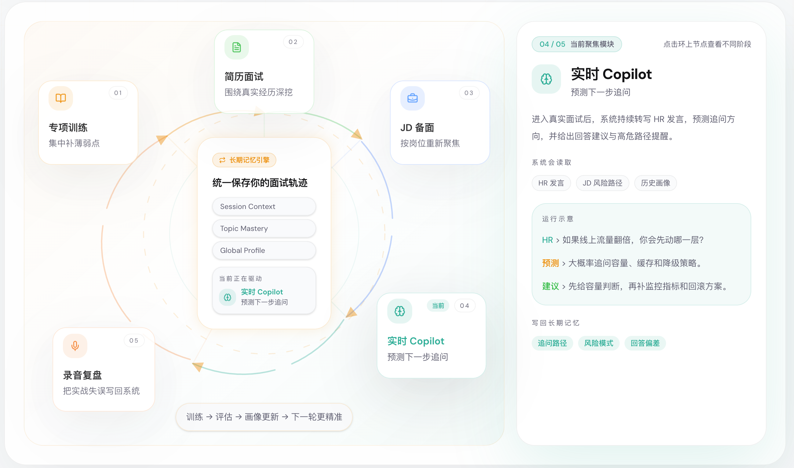
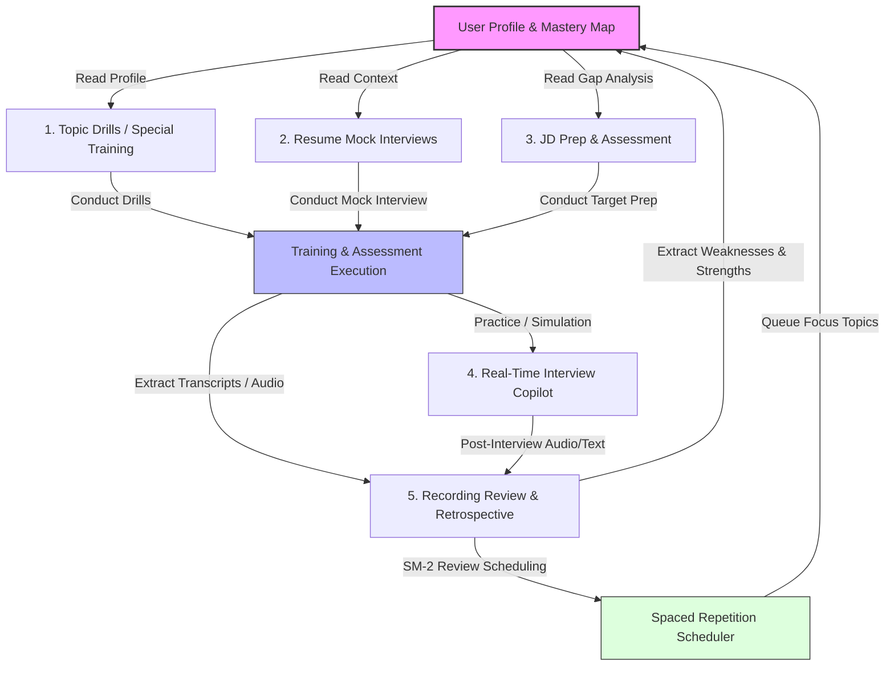

<div align="center">


### **A closed-loop, agentic technical interview platform that turns preparation, simulated assessment, real-time assistance, and review into a continuous cycle of self-improvement.**

[Online Demo](https://techspar.top/) · [Quick Start](#quick-start) · [Deployment Guide](docs/deployment.md) · [Developer Notes](docs/developer.md)

<br/>

[](https://fastapi.tiangolo.com/)
[](https://react.dev/)
[](https://www.langchain.com/langgraph)
[](https://www.docker.com/)
[](LICENSE)

<br/>


</div>

---

## 💡 The Core Philosophy: A Continuous Closed Loop

Unlike typical AI interview preparation products that present static lists of questions and reset your progress at the end of each session, **TechSpar is built around long-term memory, profile updates, and active feedback loops.**

Every answer you give, mistake you make, or strength you display is analyzed and written back to a central **Long-Term Memory and User Mastery Profile**. This profile acts as the single source of truth that dynamically shapes subsequent practice sessions, mock interviews, and real-time copilot advice.



### TechSpar vs. Traditional Interview Prep

| Traditional Tools | TechSpar |
| :--- | :--- |
| **Siloed Scenarios**<br>Practice, mocks, and review are disconnected. | **Unified State**<br>Topic Drills, Resume Mocks, JD Prep, Copilot, and Reviews share the same long-term profile and session memory. |
| **Ephemeral Progress**<br>Every session starts as if the system has never seen you before. | **Continuous Evolution**<br>Historical mastery, weak points, and practice trajectories are loaded before every round. |
| **Static Question Sets**<br>Fixed list of questions that you study repeatedly. | **Dynamic Question Generation**<br>Questions are synthesized on-the-fly based on your current skill level, target JD, and weaknesses. |
| **Loose Feedback**<br>Feedback is static text that ends when the session terminates. | **Adaptive Schedule**<br>Evaluations trigger SM-2 scheduler queues, modifying the focus and difficulty of future training rounds. |

---

## 🚀 Key Features

### 1. Adaptive Topic Drills (Special Training)
- Focus on specific knowledge domains (e.g., Backend, Systems, Algorithms, RAG/Agents).
- Automatically targets your historical weaknesses and customizes question difficulty based on your mastery profile.
- Integrates the **SM-2 spaced repetition algorithm** to schedule reviews at optimal times to prevent forgetting.

### 2. Structured Resume Mock Interviews
- An end-to-end simulated mock interview powered by a **LangGraph state machine**.
- Steps dynamically transition through:
  `Self-Introduction` ➔ `Core Technical Questions` ➔ `Deep Project Drilldown` ➔ `Candidate Rhetorical Questions (Q&A)`.
- Tailors questions strictly to your resume projects and tech stacks.

### 3. JD-Based Targeted Prep (Job Preparation)
- Input a Job Description (JD) to have the system disassemble requirements.
- Cross-references the JD against your resume to identify skill gaps.
- Generates targeted mock questions designed specifically to assess your readiness for that role.

### 4. Real-Time Interview Copilot
- Supports you during a live interview with low-latency suggestions.
- **Pre-Processing Node**: Generates a custom questioning strategy tree and identifies high-risk questioning paths based on the JD and your resume.
- **Real-Time Stream**: Uses WebSockets with **DashScope ASR** for instant voice transcribing.
- **Voiceprint Recognition**: Integrates **Tencent Cloud VPR** to automatically isolate candidate answers from interviewer questions.
- **Live Search**: Utilizes **Tavily Search** to perform real-time background lookups on technologies or company info during the session.

### 5. Recording Review & Retrospective
- Upload interview audio recordings or paste transcript text.
- Formats and structures the interview dialog.
- Delivers a question-by-question scorecard, grades answers, extracts critical weaknesses, and writes them back to your Mastery Profile.

---

## 🛠️ Technology Stack

* **Backend**: FastAPI, LangChain, LangGraph (state machine checkpoints), SQLite (database and checkpoints), aiosqlite, Pydantic v2.
* **Frontend**: React 19, React Router v7, Vite, Tailwind CSS v4, Radix UI Primitives, Lucide icons.
* **Vector Storage**: Custom vector indexing backend supporting semantic embedding searches (using NumPy for cosine retrieval, lightweight and fast).
* **Audio & Speech**: DashScope cloud ASR, Tencent Cloud VPR (voiceprint recognition), webrtcvad (voice activity detection), Alibaba Cloud OSS (audio storage).
* **LLMs/Web Search**: OpenAI-compatible chat client (supports any OpenAI-compatible API base), Tavily (web search).

---

## ⚙️ Configuration & Credentials

### 1. Global Setup (`.env`)
Configure the system-level parameters. Model and service keys are kept strictly per-user and configured inside the web frontend dashboard.

Copy the environment template:
```bash
cp .env.example .env
```

Default credentials and settings in `.env`:
```env
JWT_SECRET=change-me-in-production   # Secret for user auth tokens
DEFAULT_EMAIL=admin@techspar.local   # Admin email
DEFAULT_PASSWORD=admin123            # Admin password
DEFAULT_NAME=admin                   # Admin name
ALLOW_REGISTRATION=false             # Toggle user sign-up
```

### 2. User-Specific Keys (Settings Dashboard)
Once logged in, you can configure your personal LLM and Embedding models.
* **LLM**: Any OpenAI-compatible endpoint (API Base URL + API Key + Model Name).
* **Embedding**: Supports both `api` model endpoints and `local` HuggingFace models (requires installing local embedding dependencies).

> **Zero-Cost Free Tier Setup Example:**
> - **Main LLM**: ModelScope `ZhipuAI/GLM-5` (Base: `https://api-inference.modelscope.cn/v1`, Key: ModelScope SDK Token from [ModelScope](https://modelscope.cn/home)).
> - **Embedding**: SiliconFlow `BAAI/bge-large-zh-v1.5` (Base: `https://api.siliconflow.cn/v1`, Key: API Key from [SiliconFlow Cloud](https://cloud.siliconflow.cn/)).

### 3. Custom System-wide LLM (e.g., Nvidia GLM)
If the backend detects an `NVIDIA_API_KEY` env variable, it automatically configures all LLM interactions to use Nvidia’s `z-ai/glm-5.2` model base:
```env
NVIDIA_API_KEY=your_nvidia_api_key_here
```

### 4. Optional Cloud Services (Configured per-user)
* **DashScope**: Enables speech-to-text, real-time Copilot transcribing, and audio recording review.
* **Tavily**: Enables real-time company/technology search for the Copilot.
* **Alibaba Cloud OSS**: Required for uploading long audio recordings (>60s).
* **Tencent Cloud VPR**: Enables voiceprint recognition to distinguish candidate/interviewer automatically.

---

## 🚀 Quick Start

### Method A: Docker Compose (Recommended)
Make sure you have Docker and Docker Compose installed:

```bash
docker compose up --build
```

Access the application in your browser:
* **Web UI**: [http://localhost](http://localhost)
* **Backend API Documentation**: [http://localhost:8000/docs](http://localhost:8000/docs)

---

### Method B: Manual Local Execution

#### 1. Backend Setup
Navigate to the root directory, create a virtual environment, and install dependencies:
```bash
python3 -m venv venv
source venv/bin/activate
pip install -r requirements.txt
```

*(Optional)* If you wish to run local HuggingFace embeddings instead of API-based embeddings:
```bash
pip install -r requirements.local-embedding.txt
```

Launch the FastAPI backend server:
```bash
uvicorn backend.main:app --reload --port 8000
```

#### 2. Frontend Setup
Navigate to the `frontend/` directory and install the packages:
```bash
cd frontend
npm install
```

Launch the frontend dev server:
```bash
npm run dev
```

Visit the frontend at [http://localhost:5173](http://localhost:5173).

---

## 💾 Data Migration & Backups

You can export and import user profiles, mastery history, knowledge bases, and SQLite records. 

### Export Data (Generates `techspar-backup-<timestamp>.tar.gz`):
```bash
python3 scripts/export_data.py --user-id <optional_uid>
```

### Import Data:
```bash
python3 scripts/import_data.py techspar-backup-<timestamp>.tar.gz --db-strategy overwrite --overwrite-files
```
* **UI Import**: Imports and assigns all contents directly to the currently logged-in user account.
* **CLI Import**: Restores data preserving original `user_id` ownership (best for full-instance migrations).

---

## 🤝 Contributing

We welcome issues, feedback, and pull requests!
* Feel free to submit an [Issue](https://github.com/AnnaSuSu/TechSpar/issues) for bug reports, UI improvements, or feature suggestions.
* For major changes, please open an Issue first to discuss the design.

---

## 📄 License & Acknowledgments

* **License**: CC BY-NC 4.0 (Creative Commons Attribution-NonCommercial 4.0 International)
* **Special Thanks**: Dedicated to the [LINUX DO](https://linux.do/) community for support and feedback.